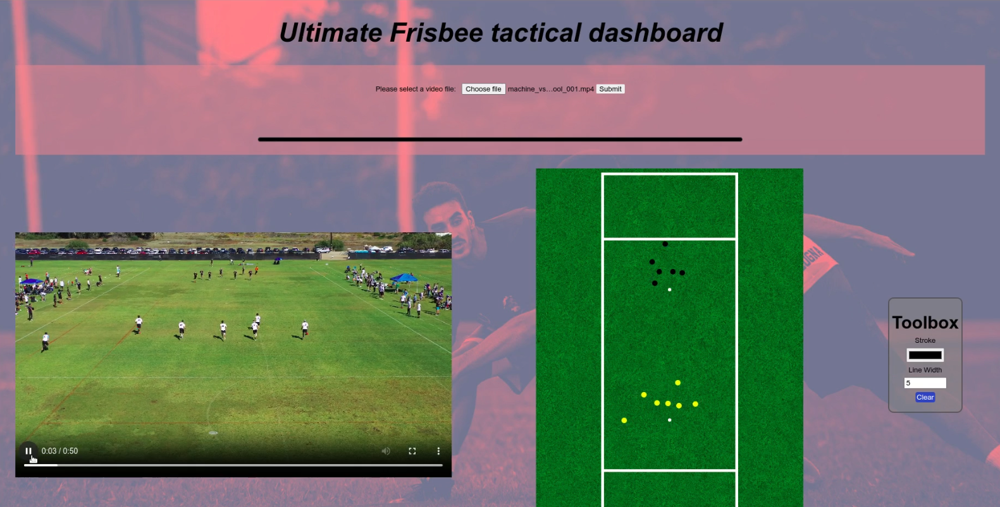

# Ultimate Frisbee Tactical Dashboard

## Summary
Ultimate Frisbee Tactical Dashboard is a project leveraging AI to extract a tactical board from Ultimate Frisbee video footage. The goal is to automate the process of analyzing gameplay and generating visual representations of player positions and movements on the field.

The Machine Learning model used for detecting players' positions is [Ultralytics YOLOv8](https://docs.ultralytics.com/).

## Project parts
This ML project consists of:
- a curated dataset of labelled Ultimate Frisbee game images, hosted on Supervisely (not included in this repository)
- a Kedro [data processing pipeline](ultimate-pipeline/README.md), downloading the curated dataset and converting it to a format used in ML training
- a trained YOLOv8 model for object detection/tracking (see [here](ultimate-pipeline/README.md#Machine-Learning-Training) for more information about ML model training)
- a [web app](web-app) that allows to analyze an uploaded video and play it side by side with a tactical board, rendered from bird's-eye view

## Presentations
- [DSR Demo Day April 2024](docs/presentations/ultimate_dashboard_demo_day.pdf) 

## Screenshots

